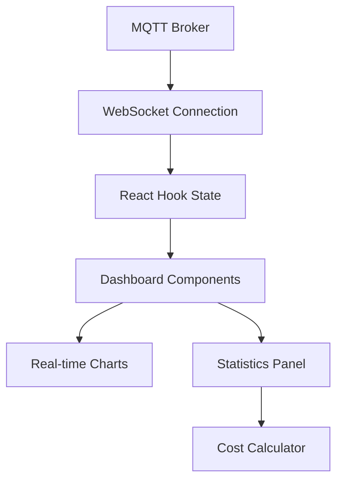

# ⚡ Gridwise - Smart Energy Simulation Platform

<div align="center">


**Real-time energy consumption simulation and optimization platform**

[](https://reactjs.org/)
[](https://www.typescriptlang.org/)
[](https://vitejs.dev/)
[](https://tailwindcss.com/)

[🚀 Live Demo](#) • [📖 Documentation](#features) • [🐛 Report Bug](#) • [💡 Request Feature](#)

</div>

---

## 🌟 Overview

**Gridwise** is a next-generation energy simulation platform that enables real-time monitoring, analysis, and optimization of electrical consumption patterns. Built for researchers, energy analysts, and smart grid developers, Gridwise provides an intuitive interface for simulating complex energy scenarios with precision and scale.

### ✨ Key Highlights

- **🔄 Real-time Simulation**: Live MQTT-based data streaming with microsecond precision
- **🎯 Advanced Analytics**: Machine learning-powered consumption prediction and optimization
- **💰 Cost Intelligence**: Real-time cost analysis with configurable pricing models
- **🎨 Intuitive Design**: Professional-grade UI with responsive design and accessibility
- **⚡ High Performance**: Handles 1000+ data points per second with optimized rendering
- **🔧 Extensible**: Plugin-based architecture for custom algorithms and integrations

---

## 🚀 Features

### 📊 **Smart Dashboard**
- **Interactive Energy Meter**: Visual gauge with real-time consumption display
- **Drag-and-Drop Interface**: Intuitive device management with visual feedback
- **Live Statistics**: Current, average, peak consumption with trend analysis
- **Cost Tracking**: Real-time and cumulative cost calculation with multiple rate structures

### 🔋 **Device Management**
- **Comprehensive Device Library**: 50+ pre-configured device profiles
- **Custom Device Creation**: Advanced device editor with consumption patterns
- **Intelligent Algorithms**: Python-based consumption algorithms with scheduling
- **Device Simulation**: Realistic consumption patterns with cycle management

### 📈 **Advanced Analytics**
- **Time-Series Visualization**: Interactive charts with Chart.js integration
- **Data Export**: Multiple formats (CSV, JSON, PDF) for further analysis
- **Historical Analysis**: Long-term trend analysis and pattern recognition
- **Performance Metrics**: Detailed simulation performance and accuracy metrics

### 🌐 **Real-time Communication**
- **MQTT Integration**: Enterprise-grade messaging with RabbitMQ
- **WebSocket Support**: Low-latency communication for real-time updates
- **Multi-platform**: Cross-platform compatibility with mobile and desktop
- **Offline Capabilities**: Local simulation mode with data synchronization

---

## 🛠️ Technology Stack

### **Frontend Architecture**
```
React 18 + TypeScript + Vite
├── UI Framework: React with Hooks & Context
├── Styling: TailwindCSS + shadcn/ui
├── Routing: TanStack Router
├── State Management: Zustand + React Query
├── Charts: Chart.js + React Chart.js 2
├── Drag & Drop: React DnD
└── Forms: React Hook Form + Zod
```

### **Real-time Communication**
```
MQTT + WebSocket
├── Message Broker: RabbitMQ
├── Protocol: MQTT over WebSocket
├── Data Format: JSON with timestamps
└── Connection Management: Auto-reconnect + Error handling
```

### **Development Tools**
```
Modern Development Stack
├── Build Tool: Vite
├── Type Checking: TypeScript 5.0+
├── Linting: ESLint + Biome
├── Code Editor: Python CodeMirror integration
└── Package Manager: npm/yarn
```

---

## 🚀 Quick Start

### Prerequisites

```bash
Node.js 18.0+ 
npm 9.0+ or yarn 1.22+
```

### Installation

1. **Clone the repository**
   ```bash
   git clone https://github.com/your-org/gridwise.git
   cd gridwise/electric_meter
   ```

2. **Install dependencies**
   ```bash
   npm install
   # or
   yarn install
   ```

3. **Set execution policy** (Windows only)
   ```powershell
   Set-ExecutionPolicy -Scope CurrentUser -ExecutionPolicy RemoteSigned
   ```

4. **Start development server**
   ```bash
   npm run dev
   # or
   yarn dev
   ```

5. **Open your browser**
   ```
   http://localhost:5173
   ```

### 🐳 Docker Setup

```bash
# Build the container
docker build -t gridwise .

# Run with MQTT broker
docker-compose up -d
```

---

## 📖 Usage Guide

### 🎮 **Basic Simulation**

1. **Start a new simulation**
   - Navigate to the main dashboard
   - Click "Start Simulation" on the electric meter

2. **Add devices**
   - Drag devices from the left palette
   - Drop them onto the electric meter canvas
   - Configure device parameters as needed

3. **Monitor consumption**
   - View real-time consumption on the gauge
   - Track statistics in the left panel
   - Switch between energy (kW) and cost ($) views

### 🔧 **Advanced Configuration**

1. **Create custom devices**
   - Go to Devices → "New Device"
   - Set consumption values, cycles, and algorithms
   - Save and use in simulations

2. **Design algorithms**
   - Navigate to Algorithms → "New Algorithm"
   - Write Python code for consumption patterns
   - Use the visual schedule editor for time-based control

3. **Export data**
   - Access Statistics page
   - Select date range and metrics
   - Export in preferred format

---

## 🏗️ Architecture

### **Component Structure**
```
src/
├── features/           # Feature-based modules
│   ├── dashboard/      # Main dashboard components
│   ├── devices/        # Device management
│   ├── algorithms/     # Algorithm editor
│   ├── electric-meter/ # Meter simulation
│   └── device-palette/ # Device library
├── components/         # Shared UI components
├── hooks/             # Custom React hooks
├── stores/            # State management
├── types/             # TypeScript definitions
└── utils/             # Utility functions
```

### **Data Flow**


---

## 🔌 API Reference

### **MQTT Message Format**

```typescript
interface ConsumptionMessage {
  value: number;           // Consumption in kW
  unit: string;            // Unit (e.g., "kW")
  time_unit: string;       // Time unit (e.g., "seconds")
  time_speed: number;      // Simulation speed multiplier
  simulation_id: string;   // Unique simulation identifier
  timestamp: number;       // Unix timestamp
}
```

### **Device Configuration**

```typescript
interface Device {
  id: string;
  name: string;
  description: string;
  consumption_value: number;    // Base consumption (kW)
  peak_consumption: number;     // Peak consumption (kW)
  cycle_duration: number;       // Cycle length (seconds)
  on_duration: number;          // Active duration (seconds)
  algorithm_id: string;         // Associated algorithm
  is_default: boolean;          // Default device flag
}
```

---

## 🧪 Testing

### **Run Tests**
```bash
npm run test
# or
yarn test
```

### **Test Coverage**
```bash
npm run test:coverage
# or
yarn test:coverage
```

### **E2E Testing**
```bash
npm run test:e2e
# or
yarn test:e2e
```

---

## 📊 Performance

### **Benchmarks**
- **Data Processing**: 1,000+ messages/second
- **UI Rendering**: 60 FPS with 50+ active devices
- **Memory Usage**: < 100MB for typical simulations
- **Load Time**: < 2 seconds on modern browsers
- **Bundle Size**: < 1MB gzipped

### **Optimization Features**
- ✅ Virtual scrolling for large datasets
- ✅ Chart data windowing (50-point limit)
- ✅ Efficient state management with Zustand
- ✅ Code splitting with dynamic imports
- ✅ Image optimization and lazy loading

---

## 🤝 Contributing

We welcome contributions from the community! Please see our [Contributing Guide](CONTRIBUTING.md) for details.

### **Development Workflow**

1. Fork the repository
2. Create a feature branch (`git checkout -b feature/amazing-feature`)
3. Commit your changes (`git commit -m 'Add amazing feature'`)
4. Push to the branch (`git push origin feature/amazing-feature`)
5. Open a Pull Request

### **Code Standards**
- Follow TypeScript best practices
- Use ESLint and Prettier for formatting
- Write meaningful commit messages
- Add tests for new features
- Update documentation as needed

---

## 📋 Roadmap

### **Q1 2024**
- [ ] Machine Learning consumption prediction
- [ ] Advanced export formats (Excel, Power BI)
- [ ] Multi-tenant support
- [ ] Mobile app (React Native)

### **Q2 2024**
- [ ] Cloud deployment automation
- [ ] REST API for third-party integrations
- [ ] Advanced scheduling algorithms
- [ ] Real-time collaboration features

### **Q3 2024**
- [ ] IoT device integration
- [ ] Blockchain-based energy trading simulation
- [ ] Advanced analytics dashboard
- [ ] Multi-language support

---

## 📄 License

This project is licensed under the MIT License - see the [LICENSE](LICENSE) file for details.

---

## 💫 Acknowledgments

- **React Team** for the amazing framework
- **Vercel** for Vite and modern tooling
- **Tailwind Labs** for the utility-first CSS framework
- **TanStack** for excellent React libraries
- **Chart.js** for powerful visualization capabilities

---

## 📞 Support

### **Community**
- 💬 [Discord](https://discord.gg/gridwise)
- 📧 [Email Support](mailto:support@gridwise.com)
- 🐛 [Issue Tracker](https://github.com/your-org/gridwise/issues)
- 📚 [Documentation](https://docs.gridwise.com)

### **Enterprise**
For enterprise support and custom solutions, contact us at [enterprise@gridwise.com](mailto:enterprise@gridwise.com)

---

<div align="center">

**Made with ❤️ by the Gridwise Team**

[Website](https://gridwise.com) • [Blog](https://blog.gridwise.com) • [Twitter](https://twitter.com/gridwise) • [LinkedIn](https://linkedin.com/company/gridwise)

⭐ **Star us on GitHub — it helps!**

</div>